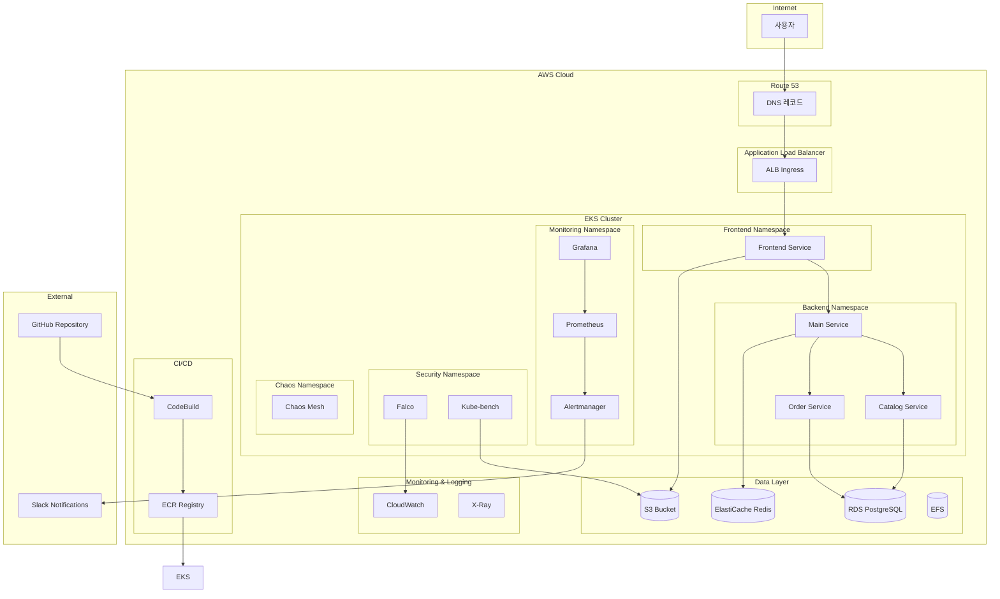
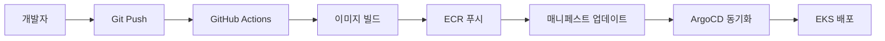

# Design Document

## Overview

AWS EKS 기반 MSA 웹서비스 운영 및 트러블슈팅 학습 플랫폼은 실제 프로덕션 환경과 유사한 복잡성을 가진 마이크로서비스 아키텍처를 제공합니다. 이 플랫폼은 SRE/인프라 엔지니어가 AWS, Kubernetes, 애플리케이션 계층의 문제를 체계적으로 학습하고 해결할 수 있도록 설계되었습니다.

## Architecture

### High-Level Architecture



### Network Architecture

- **VPC**: 3개 AZ에 걸친 프라이빗/퍼블릭 서브넷 구성
- **EKS 클러스터**: 프라이빗 서브넷에 워커 노드 배치
- **ALB**: 퍼블릭 서브넷에서 인터넷 트래픽 수신
- **NAT Gateway**: 프라이빗 서브넷의 아웃바운드 트래픽 처리
- **보안 그룹**: 최소 권한 원칙에 따른 네트워크 접근 제어

## Components and Interfaces

### 1. Infrastructure Components

#### EKS 클러스터
- **버전**: 1.28 이상
- **노드 그룹**: 
  - 시스템 노드 그룹 (t3.medium, 2-4 노드)
  - 애플리케이션 노드 그룹 (t3.large, 2-6 노드, 오토스케일링)
- **네트워킹**: AWS VPC CNI
- **스토리지**: EBS CSI Driver, EFS CSI Driver

#### IRSA (IAM Roles for Service Accounts)
```yaml
# 주요 서비스별 IAM 역할
- S3 Access Role: 파일 업로드 서비스용
- RDS Access Role: 데이터베이스 연결용
- CloudWatch Role: 로그 및 메트릭 전송용
- ECR Access Role: 이미지 풀용
```

### 2. Application Components

#### Frontend Service
- **기술 스택**: React.js + TypeScript
- **컨테이너**: nginx 기반 정적 파일 서빙
- **기능**:
  - 상품 카탈로그 조회
  - 주문 생성 및 조회
  - 파일 업로드 (S3)
  - 실시간 상태 모니터링 대시보드

#### Main Service (API Gateway)
- **기술 스택**: Node.js + Express.js
- **역할**: 마이크로서비스 오케스트레이션
- **API 엔드포인트**:
  ```
  GET /api/health - 헬스체크
  GET /api/products - 상품 목록 (Catalog Service 호출)
  POST /api/orders - 주문 생성 (Order Service 호출)
  GET /api/orders/:id - 주문 조회 (Order Service 호출)
  POST /api/upload - 파일 업로드 (S3)
  ```

#### Catalog Service
- **기술 스택**: Python + FastAPI
- **데이터베이스**: PostgreSQL (상품 정보)
- **캐시**: Redis (상품 조회 성능 최적화)
- **API 엔드포인트**:
  ```
  GET /catalog/products - 상품 목록
  GET /catalog/products/:id - 상품 상세
  POST /catalog/products - 상품 등록
  PUT /catalog/products/:id - 상품 수정
  DELETE /catalog/products/:id - 상품 삭제
  ```

#### Order Service
- **기술 스택**: Java + Spring Boot
- **데이터베이스**: PostgreSQL (주문 정보)
- **메시징**: Redis Pub/Sub (주문 상태 알림)
- **API 엔드포인트**:
  ```
  POST /orders - 주문 생성
  GET /orders/:id - 주문 조회
  PUT /orders/:id/status - 주문 상태 변경
  GET /orders/user/:userId - 사용자별 주문 목록
  ```

### 3. Data Layer Components

#### RDS PostgreSQL
- **구성**: Multi-AZ 배포
- **인스턴스**: db.t3.micro (학습용)
- **데이터베이스**:
  - `catalog_db`: 상품 정보
  - `order_db`: 주문 정보
- **백업**: 자동 백업 7일 보관
- **모니터링**: Performance Insights 활성화

#### ElastiCache Redis
- **구성**: 클러스터 모드 비활성화
- **노드**: cache.t3.micro
- **용도**:
  - 상품 정보 캐싱
  - 세션 스토리지
  - Pub/Sub 메시징

#### S3 Bucket
- **용도**: 
  - 정적 파일 저장
  - 애플리케이션 로그 아카이브
  - kube-bench 결과 저장
- **보안**: 버킷 정책 및 CORS 설정

#### EFS
- **용도**: 
  - 공유 설정 파일
  - 로그 파일 공유
  - 임시 파일 저장

### 4. Monitoring and Observability

#### Prometheus Stack
- **Prometheus**: 메트릭 수집 및 저장
- **Grafana**: 시각화 및 대시보드
- **Alertmanager**: 알람 관리 및 라우팅
- **Node Exporter**: 노드 메트릭 수집
- **kube-state-metrics**: Kubernetes 리소스 메트릭

#### 주요 SLI/SLO 메트릭
```yaml
SLI_Metrics:
  - name: "API 응답 시간"
    threshold: "95% < 500ms"
    
  - name: "에러율"
    threshold: "< 1%"
    
  - name: "서비스 가용성"
    threshold: "> 99.9%"
    
  - name: "데이터베이스 연결"
    threshold: "연결 수 < 80%"
```

#### 로그 관리
- **수집**: Fluent Bit
- **저장**: CloudWatch Logs
- **분석**: CloudWatch Insights
- **알람**: CloudWatch Alarms → SNS → Slack

### 5. Security Components

#### Network Security
- **Network Policies**: Pod 간 통신 제한
- **Security Groups**: AWS 레벨 방화벽
- **RBAC**: Kubernetes 역할 기반 접근 제어

#### Runtime Security
- **Falco**: 런타임 위협 탐지
- **kube-bench**: CIS 벤치마크 준수 검사
- **이미지 스캔**: ECR 취약점 스캔

#### Secrets Management
- **AWS Secrets Manager**: 데이터베이스 자격증명
- **Kubernetes Secrets**: 애플리케이션 설정
- **External Secrets Operator**: 외부 시크릿 동기화

## Data Models

### Catalog Service Data Model
```sql
-- 상품 테이블
CREATE TABLE products (
    id SERIAL PRIMARY KEY,
    name VARCHAR(255) NOT NULL,
    description TEXT,
    price DECIMAL(10,2) NOT NULL,
    category_id INTEGER,
    stock_quantity INTEGER DEFAULT 0,
    image_url VARCHAR(500),
    created_at TIMESTAMP DEFAULT CURRENT_TIMESTAMP,
    updated_at TIMESTAMP DEFAULT CURRENT_TIMESTAMP
);

-- 카테고리 테이블
CREATE TABLE categories (
    id SERIAL PRIMARY KEY,
    name VARCHAR(100) NOT NULL,
    description TEXT,
    parent_id INTEGER REFERENCES categories(id)
);
```

### Order Service Data Model
```sql
-- 주문 테이블
CREATE TABLE orders (
    id SERIAL PRIMARY KEY,
    user_id VARCHAR(100) NOT NULL,
    total_amount DECIMAL(10,2) NOT NULL,
    status VARCHAR(50) DEFAULT 'pending',
    shipping_address TEXT,
    created_at TIMESTAMP DEFAULT CURRENT_TIMESTAMP,
    updated_at TIMESTAMP DEFAULT CURRENT_TIMESTAMP
);

-- 주문 상품 테이블
CREATE TABLE order_items (
    id SERIAL PRIMARY KEY,
    order_id INTEGER REFERENCES orders(id),
    product_id INTEGER NOT NULL,
    quantity INTEGER NOT NULL,
    unit_price DECIMAL(10,2) NOT NULL,
    total_price DECIMAL(10,2) NOT NULL
);
```

## Error Handling

### Application Level Error Handling

#### HTTP 상태 코드 표준
```yaml
Success_Codes:
  - 200: 성공적인 GET 요청
  - 201: 성공적인 POST 요청 (리소스 생성)
  - 204: 성공적인 DELETE 요청

Client_Error_Codes:
  - 400: 잘못된 요청 형식
  - 401: 인증 실패
  - 403: 권한 부족
  - 404: 리소스 없음
  - 409: 리소스 충돌

Server_Error_Codes:
  - 500: 내부 서버 오류
  - 502: 업스트림 서비스 오류
  - 503: 서비스 일시 불가
  - 504: 게이트웨이 타임아웃
```

#### Circuit Breaker Pattern
```javascript
// Main Service에서 다른 서비스 호출 시
const circuitBreaker = {
  failureThreshold: 5,
  timeout: 10000,
  resetTimeout: 30000
};
```

### Infrastructure Level Error Handling

#### Pod 장애 복구
- **Liveness Probe**: 애플리케이션 상태 확인
- **Readiness Probe**: 트래픽 수신 준비 상태 확인
- **Restart Policy**: Always (자동 재시작)

#### 노드 장애 복구
- **Node Affinity**: 노드 선호도 설정
- **Pod Disruption Budget**: 최소 가용 Pod 수 보장
- **Cluster Autoscaler**: 노드 자동 확장/축소

#### 데이터베이스 장애 복구
- **Connection Pooling**: 연결 풀 관리
- **Retry Logic**: 지수 백오프 재시도
- **Failover**: Multi-AZ 자동 장애조치

## Testing Strategy

### 1. Unit Testing
- **Frontend**: Jest + React Testing Library
- **Backend Services**: 각 언어별 테스트 프레임워크
  - Node.js: Jest
  - Python: pytest
  - Java: JUnit 5

### 2. Integration Testing
- **API 테스트**: Postman/Newman
- **데이터베이스 테스트**: Testcontainers
- **서비스 간 통신 테스트**: Contract Testing

### 3. End-to-End Testing
- **UI 테스트**: Cypress
- **API 워크플로우 테스트**: k6

### 4. Performance Testing
```yaml
Performance_Test_Scenarios:
  - name: "정상 부하 테스트"
    users: 100
    duration: "10m"
    
  - name: "스파이크 테스트"
    users: 500
    duration: "2m"
    
  - name: "내구성 테스트"
    users: 50
    duration: "1h"
```

### 5. Chaos Engineering
```yaml
Chaos_Experiments:
  - name: "Pod 장애"
    target: "random pod"
    duration: "5m"
    
  - name: "네트워크 지연"
    target: "service communication"
    latency: "100ms"
    duration: "10m"
    
  - name: "CPU 스트레스"
    target: "worker nodes"
    cpu_load: "80%"
    duration: "15m"
```

### 6. Security Testing
- **취약점 스캔**: Trivy, Clair
- **침투 테스트**: OWASP ZAP
- **컴플라이언스 검사**: kube-bench, Falco

## Deployment Strategy

### GitOps Workflow


### Blue-Green Deployment
- **Blue Environment**: 현재 운영 중인 버전
- **Green Environment**: 새로운 버전 배포
- **트래픽 전환**: ALB 가중치 기반 점진적 전환
- **롤백**: 즉시 Blue 환경으로 복구

### Canary Deployment
- **초기 배포**: 5% 트래픽
- **모니터링**: 에러율, 응답시간 확인
- **점진적 확장**: 10% → 25% → 50% → 100%
- **자동 롤백**: 임계값 초과 시 자동 복구

## Learning Scenarios

### 시나리오 1: 기본 배포 및 모니터링
1. **목표**: EKS 클러스터 구축 및 기본 애플리케이션 배포
2. **학습 내용**: 
   - Terraform을 통한 인프라 구축
   - Helm을 통한 애플리케이션 배포
   - Prometheus/Grafana 모니터링 설정
3. **검증 방법**: 웹 애플리케이션 접근 및 메트릭 확인

### 시나리오 2: 오토스케일링 및 성능 테스트
1. **목표**: HPA 설정 및 부하 테스트
2. **학습 내용**:
   - HPA 정책 설정
   - k6를 통한 부하 테스트
   - 스케일링 동작 관찰
3. **검증 방법**: Pod 수 변화 및 응답시간 측정

### 시나리오 3: 장애 대응 및 복구
1. **목표**: 다양한 장애 상황 시뮬레이션 및 대응
2. **학습 내용**:
   - Chaos Mesh를 통한 장애 주입
   - 모니터링 알람 확인
   - 수동/자동 복구 절차
3. **검증 방법**: 복구 시간 및 서비스 영향도 측정

### 시나리오 4: 보안 강화 및 컴플라이언스
1. **목표**: 보안 도구 설정 및 취약점 해결
2. **학습 내용**:
   - kube-bench 실행 및 결과 분석
   - Falco 알람 설정
   - Network Policy 적용
3. **검증 방법**: 보안 점수 개선 및 위협 탐지 확인

이 설계는 실제 프로덕션 환경의 복잡성을 반영하면서도 학습 목적에 맞게 단계적으로 구성되어 있습니다. 각 컴포넌트는 독립적으로 학습할 수 있으면서도 전체적인 시스템 이해를 돕도록 설계되었습니다.